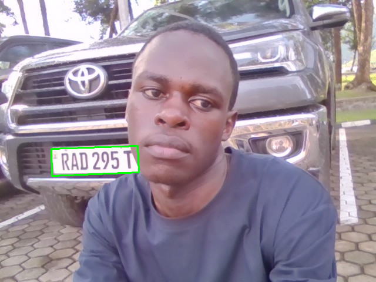
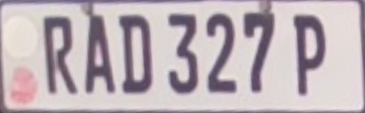

# ANPR Project

This project implements a simple and explicit Automatic Number Plate Recognition (ANPR) pipeline.

## Pipeline Overview

This book is built around a simple and explicit pipeline:

1. **Step 1 — Plate Detection**  
   Locate an image region that is likely to contain a car number plate.
2. **Step 2 — Plate Alignment**  
   Correct tilt, skew, and perspective so that characters appear upright and evenly spaced.
3. **Step 3 — OCR**  
   Extract text from the aligned plate image.

In deployment, two additional practical stages are usually added after OCR:

4. **Validation**  
   Check whether the extracted text follows an expected plate pattern.
5. **Persistence**  
   Save the confirmed plate into a persistent log file—implemented in this project as a CSV file—together with a timestamp.

The full practical flow is therefore:

`Camera -> Plate Detection -> Plate Alignment -> OCR -> Regex Validation -> CSV Logging`

## Project Structure

```text
anpr-project/
|
|-- README.md
|-- requirements.txt
|
|-- src/
|   |-- detect.py
|   |-- align.py
|   |-- ocr.py
|   |-- validate.py
|   `-- main.py
|
|-- data/
|   `-- plates.csv
|
`-- screenshots/
    |-- detection.png
    |-- alignment.png
    `-- ocr.png
```

## Installation

1. Create and activate a virtual environment.
2. Install dependencies:

```bash
pip install -r requirements.txt
```

3. Install Tesseract OCR engine:
   - Windows: install from the official Tesseract installer.
   - Update the path in scripts if needed:

```python
pytesseract.pytesseract.tesseract_cmd = r"C:\Program Files\Tesseract-OCR\tesseract.exe"
```

## How to Run

From the project root:

```bash
python src/detect.py
python src/align.py
python src/ocr.py
python src/validate.py
python src/main.py
```

- `detect.py`: detection stage only
- `align.py`: detection + alignment stage
- `ocr.py`: detection + alignment + OCR
- `validate.py`: adds regex validation
- `main.py`: full capture pipeline with CSV logging to `data/plates.csv`

### Full Capture Workflow (`src/main.py`)

1. Start the script.
2. Press `c` to capture a **vehicle image** from the camera.
3. The script saves the vehicle image, then processes that saved image to:
   - detect the number plate,
   - align it,
   - run OCR,
   - validate via regex,
   - save the extracted plate screenshot.
4. Captured results are logged into CSV with timestamp.

Saved outputs:

- Vehicle captures: `data/vehicles/`
- Extracted plate screenshots: `data/plates/`
- Capture logs: `data/plates.csv`

## Camera Orientation (Important)

The camera frame is corrected so that left/right are not mirrored (real-left stays real-left).

## Screenshots of Results

These screenshots are automatically updated with real capture results when you press `c` in `src/main.py`.

Expected files in `screenshots/`:

- `screenshots/detection.png`
- `screenshots/alignment.png`
- `screenshots/ocr.png`

They are rendered below in the README:





## Output Logging

Captured results are appended to:

- `data/plates.csv`

CSV format:

```csv
plate,timestamp
ABC123D,2026-03-31 11:00:00
UNKNOWN,2026-03-31 11:00:05
```

If your local plate format differs, set a custom validation regex before running:

```powershell
$env:ANPR_PLATE_REGEX = "[A-Z0-9]{6,8}"
python src/main.py
```
